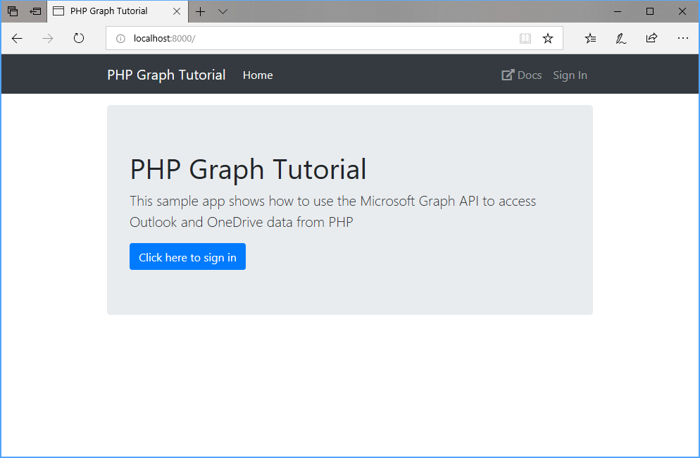

<!-- markdownlint-disable MD002 MD041 -->

<span data-ttu-id="7ca18-101">コマンドラインインターフェイス (CLI) を開き、ファイルを作成する権限があるディレクトリに移動し、次のコマンドを実行して新しい PHP アプリを作成します。</span><span class="sxs-lookup"><span data-stu-id="7ca18-101">Open your command-line interface (CLI), navigate to a directory where you have rights to create files, and run the following command to create a new PHP app.</span></span>

```Shell
laravel new graph-tutorial
```

<span data-ttu-id="7ca18-102">Laravel は、PHP アプリおよび`graph-tutorial`スキャフォールディングという名前の新しいディレクトリを作成します。</span><span class="sxs-lookup"><span data-stu-id="7ca18-102">Laravel creates a new directory called `graph-tutorial` and scaffolds a PHP app.</span></span> <span data-ttu-id="7ca18-103">この新しいディレクトリに移動し、次のコマンドを入力してローカル web サーバーを開始します。</span><span class="sxs-lookup"><span data-stu-id="7ca18-103">Navigate to this new directory and enter the following command to start a local web server.</span></span>

```Shell
php artisan serve
```

<span data-ttu-id="7ca18-104">ブラウザーを開き、`http://localhost:8000` に移動します。</span><span class="sxs-lookup"><span data-stu-id="7ca18-104">Open your browser and navigate to `http://localhost:8000`.</span></span> <span data-ttu-id="7ca18-105">すべてが動作している場合は、既定の Laravel ページが表示されます。</span><span class="sxs-lookup"><span data-stu-id="7ca18-105">If everything is working, you will see a default Laravel page.</span></span> <span data-ttu-id="7ca18-106">そのページが表示されない場合は、 [Laravel のドキュメント](https://laravel.com/docs/6.0)を確認してください。</span><span class="sxs-lookup"><span data-stu-id="7ca18-106">If you don't see that page, check the [Laravel docs](https://laravel.com/docs/6.0).</span></span>

<span data-ttu-id="7ca18-107">に進む前に、後で使用する追加のライブラリをインストールします。</span><span class="sxs-lookup"><span data-stu-id="7ca18-107">Before moving on, install some additional libraries that you will use later:</span></span>

- <span data-ttu-id="7ca18-108">[oauth2-](https://github.com/thephpleague/oauth2-client)サインインおよび OAuth トークンフローを処理するためのクライアントです。</span><span class="sxs-lookup"><span data-stu-id="7ca18-108">[oauth2-client](https://github.com/thephpleague/oauth2-client) for handling sign-in and OAuth token flows.</span></span>
- <span data-ttu-id="7ca18-109">microsoft graph に電話をかけるための[グラフ](https://github.com/microsoftgraph/msgraph-sdk-php)です。</span><span class="sxs-lookup"><span data-stu-id="7ca18-109">[microsoft-graph](https://github.com/microsoftgraph/msgraph-sdk-php) for making calls to Microsoft Graph.</span></span>

<span data-ttu-id="7ca18-110">CLI で次のコマンドを実行します。</span><span class="sxs-lookup"><span data-stu-id="7ca18-110">Run the following command in your CLI.</span></span>

```Shell
composer require league/oauth2-client:dev-master microsoft/microsoft-graph
```

## <a name="design-the-app"></a><span data-ttu-id="7ca18-111">アプリを設計する</span><span class="sxs-lookup"><span data-stu-id="7ca18-111">Design the app</span></span>

<span data-ttu-id="7ca18-112">最初に、アプリのグローバルレイアウトを作成します。</span><span class="sxs-lookup"><span data-stu-id="7ca18-112">Start by creating the global layout for the app.</span></span> <span data-ttu-id="7ca18-113">という名前`./resources/views` `layout.blade.php`のディレクトリに新しいファイルを作成し、次のコードを追加します。</span><span class="sxs-lookup"><span data-stu-id="7ca18-113">Create a new file in the  `./resources/views` directory named `layout.blade.php` and add the following code.</span></span>

```php
<!DOCTYPE html>
<html>
  <head>
    <title>PHP Graph Tutorial</title>

    <link rel="stylesheet" href="https://stackpath.bootstrapcdn.com/bootstrap/4.1.1/css/bootstrap.min.css"
        integrity="sha384-WskhaSGFgHYWDcbwN70/dfYBj47jz9qbsMId/iRN3ewGhXQFZCSftd1LZCfmhktB" crossorigin="anonymous">
    <link rel="stylesheet" href="https://use.fontawesome.com/releases/v5.1.0/css/all.css"
        integrity="sha384-lKuwvrZot6UHsBSfcMvOkWwlCMgc0TaWr+30HWe3a4ltaBwTZhyTEggF5tJv8tbt" crossorigin="anonymous">
    <link rel="stylesheet" href="{{ asset('/css/app.css') }}">
    <script src="https://code.jquery.com/jquery-3.3.1.min.js"></script>
    <script src="https://cdnjs.cloudflare.com/ajax/libs/popper.js/1.14.3/umd/popper.min.js"
        integrity="sha384-ZMP7rVo3mIykV+2+9J3UJ46jBk0WLaUAdn689aCwoqbBJiSnjAK/l8WvCWPIPm49" crossorigin="anonymous"></script>
    <script src="https://stackpath.bootstrapcdn.com/bootstrap/4.1.1/js/bootstrap.min.js"
        integrity="sha384-smHYKdLADwkXOn1EmN1qk/HfnUcbVRZyYmZ4qpPea6sjB/pTJ0euyQp0Mk8ck+5T" crossorigin="anonymous"></script>
  </head>

  <body>
    <nav class="navbar navbar-expand-md navbar-dark fixed-top bg-dark">
      <div class="container">
        <a href="/" class="navbar-brand">PHP Graph Tutorial</a>
        <button class="navbar-toggler" type="button" data-toggle="collapse" data-target="#navbarCollapse"
            aria-controls="navbarCollapse" aria-expanded="false" aria-label="Toggle navigation">
          <span class="navbar-toggler-icon"></span>
        </button>
        <div class="collapse navbar-collapse" id="navbarCollapse">
          <ul class="navbar-nav mr-auto">
            <li class="nav-item">
              <a href="/" class="nav-link {{$_SERVER['REQUEST_URI'] == '/' ? ' active' : ''}}">Home</a>
            </li>
            @if(isset($userName))
              <li class="nav-item" data-turbolinks="false">
                <a href="/calendar" class="nav-link{{$_SERVER['REQUEST_URI'] == '/calendar' ? ' active' : ''}}">Calendar</a>
              </li>
            @endif
          </ul>
          <ul class="navbar-nav justify-content-end">
            <li class="nav-item">
              <a class="nav-link" href="https://developer.microsoft.com/graph/docs/concepts/overview" target="_blank">
                <i class="fas fa-external-link-alt mr-1"></i>Docs
              </a>
            </li>
            @if(isset($userName))
              <li class="nav-item dropdown">
                <a class="nav-link dropdown-toggle" data-toggle="dropdown" href="#" role="button"
                  aria-haspopup="true" aria-expanded="false">
                  @if(isset($user_avatar))
                    
                  @else
                    <i class="far fa-user-circle fa-lg rounded-circle align-self-center mr-2" style="width: 32px;"></i>
                  @endif
                </a>
                <div class="dropdown-menu dropdown-menu-right">
                  <h5 class="dropdown-item-text mb-0">{{ $userName }}</h5>
                  <p class="dropdown-item-text text-muted mb-0">{{ $userEmail }}</p>
                  <div class="dropdown-divider"></div>
                  <a href="/signout" class="dropdown-item">Sign Out</a>
                </div>
              </li>
            @else
              <li class="nav-item">
                <a href="/signin" class="nav-link">Sign In</a>
              </li>
            @endif
          </ul>
        </div>
      </div>
    </nav>
    <main role="main" class="container">
      @if(session('error'))
        <div class="alert alert-danger" role="alert">
          <p class="mb-3">{{ session('error') }}</p>
          @if(session('errorDetail'))
            <pre class="alert-pre border bg-light p-2"><code>{{ session('errorDetail') }}</code></pre>
          @endif
        </div>
      @endif

      @yield('content')
    </main>
  </body>
</html>
```

<span data-ttu-id="7ca18-114">このコードでは、単純なスタイル設定のために[ブートストラップ](http://getbootstrap.com/)が追加さ[れてい](https://fontawesome.com/)ます。</span><span class="sxs-lookup"><span data-stu-id="7ca18-114">This code adds [Bootstrap](http://getbootstrap.com/) for simple styling, and [Font Awesome](https://fontawesome.com/) for some simple icons.</span></span> <span data-ttu-id="7ca18-115">また、ナビゲーションバーのあるグローバルレイアウトを定義します。</span><span class="sxs-lookup"><span data-stu-id="7ca18-115">It also defines a global layout with a nav bar.</span></span>

<span data-ttu-id="7ca18-116">と`./public`いう名前`css`のディレクトリに新しいディレクトリを作成し、という名前`./public/css` `app.css`のディレクトリに新しいファイルを作成します。</span><span class="sxs-lookup"><span data-stu-id="7ca18-116">Create a new directory in the `./public` directory named `css`, then create a new file in the `./public/css` directory named `app.css`.</span></span> <span data-ttu-id="7ca18-117">次のコードを追加します。</span><span class="sxs-lookup"><span data-stu-id="7ca18-117">Add the following code.</span></span>

```css
body {
  padding-top: 4.5rem;
}

.alert-pre {
  word-wrap: break-word;
  word-break: break-all;
  white-space: pre-wrap;
}
```

<span data-ttu-id="7ca18-118">ここで、既定のページを更新します。</span><span class="sxs-lookup"><span data-stu-id="7ca18-118">Now update the default page.</span></span> <span data-ttu-id="7ca18-119">`./resources/views/welcome.blade.php`ファイルを開き、その内容を次のように置き換えます。</span><span class="sxs-lookup"><span data-stu-id="7ca18-119">Open the `./resources/views/welcome.blade.php` file and replace its contents with the following.</span></span>

```php
@extends('layout')

@section('content')
<div class="jumbotron">
  <h1>PHP Graph Tutorial</h1>
  <p class="lead">This sample app shows how to use the Microsoft Graph API to access Outlook and OneDrive data from PHP</p>
  @if(isset($userName))
    <h4>Welcome {{ $userName }}!</h4>
    <p>Use the navigation bar at the top of the page to get started.</p>
  @else
    <a href="/signin" class="btn btn-primary btn-large">Click here to sign in</a>
  @endif
</div>
@endsection
```

<span data-ttu-id="7ca18-120">クラスに次`Controller`の関数`./app/Http/Controllers/Controller.php`を追加して、の基本クラスを更新します。</span><span class="sxs-lookup"><span data-stu-id="7ca18-120">Update the base `Controller` class in `./app/Http/Controllers/Controller.php` by adding the following function to the class.</span></span>

```php
public function loadViewData()
{
  $viewData = [];

  // Check for flash errors
  if (session('error')) {
    $viewData['error'] = session('error');
    $viewData['errorDetail'] = session('errorDetail');
  }

  // Check for logged on user
  if (session('userName'))
  {
    $viewData['userName'] = session('userName');
    $viewData['userEmail'] = session('userEmail');
  }

  return $viewData;
}
```

<span data-ttu-id="7ca18-121">次に、ホームページのコントローラーを追加します。</span><span class="sxs-lookup"><span data-stu-id="7ca18-121">Next, add a controller for the home page.</span></span> <span data-ttu-id="7ca18-122">という名前`./app/Http/Controllers` `HomeController.php`のディレクトリに新しいファイルを作成し、次のコードを追加します。</span><span class="sxs-lookup"><span data-stu-id="7ca18-122">Create a new file in the `./app/Http/Controllers` directory named `HomeController.php` and add the following code.</span></span>

```php
<?php

namespace App\Http\Controllers;

use App\Http\Controllers\Controller;
use Illuminate\Http\Request;

class HomeController extends Controller
{
  public function welcome()
  {
    $viewData = $this->loadViewData();

    return view('welcome', $viewData);
  }
}
```

<span data-ttu-id="7ca18-123">最後に、の`./routes/web.php`ルートを更新して、新しいコントローラーを使用します。</span><span class="sxs-lookup"><span data-stu-id="7ca18-123">Finally, update the route in `./routes/web.php` to use the new controller.</span></span> <span data-ttu-id="7ca18-124">このファイルの内容全体を次のように置き換えます。</span><span class="sxs-lookup"><span data-stu-id="7ca18-124">Replace the entire contents of this file with the following.</span></span>

```php
<?php

Route::get('/', 'HomeController@welcome');
```

<span data-ttu-id="7ca18-125">すべての変更を保存し、サーバーを再起動します。</span><span class="sxs-lookup"><span data-stu-id="7ca18-125">Save all of your changes and restart the server.</span></span> <span data-ttu-id="7ca18-126">この時点で、アプリの外観は大きく異なります。</span><span class="sxs-lookup"><span data-stu-id="7ca18-126">Now, the app should look very different.</span></span>


