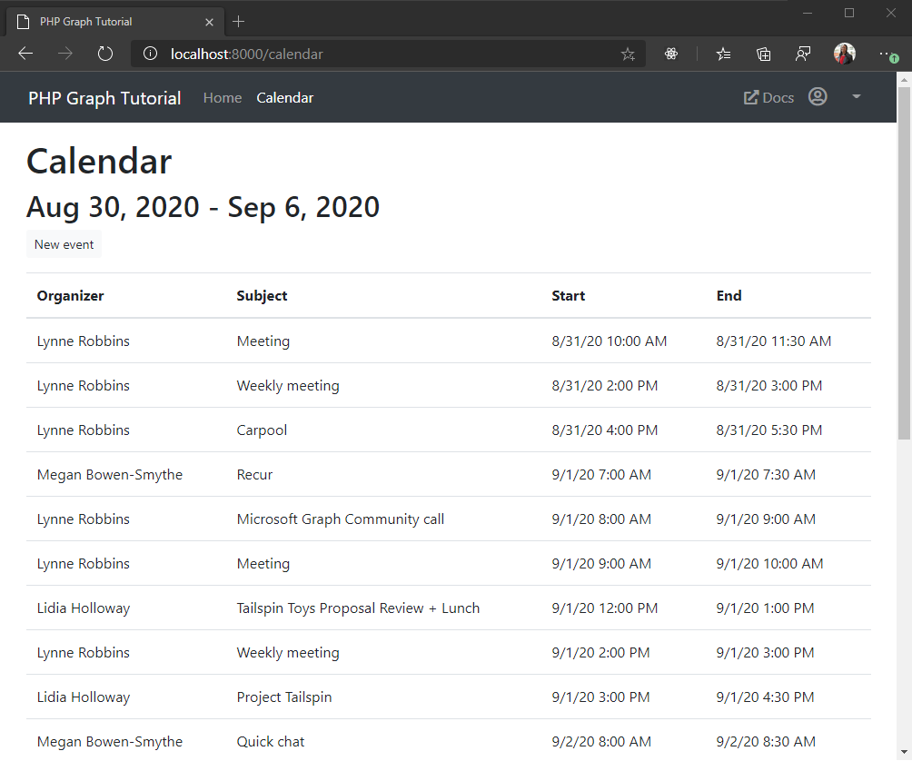

<!-- markdownlint-disable MD002 MD041 -->

この演習では、Microsoft Graph をアプリケーションに組み込みます。 このアプリケーションでは、microsoft [graph ライブラリを使用して Microsoft](https://github.com/microsoftgraph/msgraph-sdk-php) graph への呼び出しを行います。

## <a name="get-calendar-events-from-outlook"></a>Outlook からカレンダー イベントを取得する

1. という名前`CalendarController.php`の **/app/Http/Controllers**ディレクトリに新しいファイルを作成し、次のコードを追加します。

    ```php
    <?php

    namespace App\Http\Controllers;

    use App\Http\Controllers\Controller;
    use Illuminate\Http\Request;
    use Microsoft\Graph\Graph;
    use Microsoft\Graph\Model;
    use App\TokenStore\TokenCache;

    class CalendarController extends Controller
    {
      public function calendar()
      {
        $viewData = $this->loadViewData();

        // Get the access token from the cache
        $tokenCache = new TokenCache();
        $accessToken = $tokenCache->getAccessToken();

        // Create a Graph client
        $graph = new Graph();
        $graph->setAccessToken($accessToken);

        $queryParams = array(
          '$select' => 'subject,organizer,start,end',
          '$orderby' => 'createdDateTime DESC'
        );

        // Append query parameters to the '/me/events' url
        $getEventsUrl = '/me/events?'.http_build_query($queryParams);

        $events = $graph->createRequest('GET', $getEventsUrl)
          ->setReturnType(Model\Event::class)
          ->execute();

        return response()->json($events);
      }
    }
    ```

    このコードの実行内容を考えましょう。

    - 呼び出される URL は `/v1.0/me/events` です。
    - パラメーター `$select`は、各イベントに対して返されるフィールドを、ビューが実際に使用するものだけに制限します。
    - パラメーター `$orderby`は、生成された日付と時刻で結果を並べ替えます。最新のアイテムが最初に表示されます。

1. **/Routes/web.php**のルートを更新して、この新しいコントローラーにルートを追加します。

    ```php
    Route::get('/calendar', 'CalendarController@calendar');
    ```

1. サインインして、ナビゲーションバーの [**予定表**] リンクをクリックします。 すべてが正常に機能していれば、ユーザーのカレンダーにイベントの JSON ダンプが表示されます。

## <a name="display-the-results"></a>結果の表示

結果を表示するとき、よりユーザー フレンドリなビューを追加できます。

1. という名前`calendar.blade.php`の **./resources/views**ディレクトリに新しいファイルを作成し、次のコードを追加します。

    :::code language="php" source="../demo/graph-tutorial/resources/views/calendar.blade.php" id="CalendarSnippet":::

    これにより、イベントのコレクションがループされ、各イベントにテーブル行が追加されます。

1. /App/Http/Controllers/CalendarController.php の`return response()->json($events);` `calendar`アクションから行を削除 **./app/Http/Controllers/CalendarController.php**し、次のコードに置き換えます。

    ```php
    $viewData['events'] = $events;
    return view('calendar', $viewData);
    ```

1. ページを更新すると、アプリがイベントの表を表示するようになります。

    
