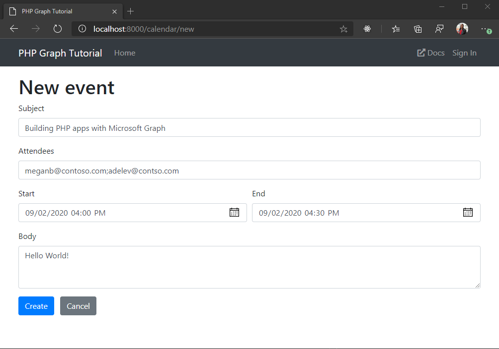

<!-- markdownlint-disable MD002 MD041 -->

このセクションでは、ユーザーの予定表にイベントを作成する機能を追加します。

## <a name="create-new-event-form"></a>新しいイベントフォームを作成する

1. という名前の **./resources/views** ディレクトリに新しいファイルを作成 `newevent.blade.php` し、次のコードを追加します。

    :::code language="php" source="../demo/graph-tutorial/resources/views/newevent.blade.php" id="NewEventFormSnippet":::

## <a name="add-controller-actions"></a>コントローラーアクションを追加する

1. **/App/Http/Controllers/CalendarController.php**を開き、次の関数を追加してフォームを表示します。

    :::code language="php" source="../demo/graph-tutorial/app/Http/Controllers/CalendarController.php" id="getNewEventFormSnippet":::

1. ユーザーの送信時にフォームデータを受信し、ユーザーの予定表に新しいイベントを作成するために、次の関数を追加します。

    :::code language="php" source="../demo/graph-tutorial/app/Http/Controllers/CalendarController.php" id="createNewEventSnippet":::

    このコードの内容を検討してください。

    - 出席者フィールドの入力を Graph の [出席者](https://docs.microsoft.com/graph/api/resources/attendee?view=graph-rest-1.0) のオブジェクトの配列に変換します。
    - フォーム入力から [イベント](https://docs.microsoft.com/graph/api/resources/event?view=graph-rest-1.0) を作成します。
    - エンドポイントに投稿を送信 `/me/events` し、予定表ビューにリダイレクトします。

1. **/Routes/web.php**のルートを更新して、コントローラー上でこれらの新しい機能のルートを追加します。

    ```php
    Route::get('/calendar/new', 'CalendarController@getNewEventForm');
    Route::post('/calendar/new', 'CalendarController@createNewEvent');
    ```

1. 変更内容をすべて保存し、サーバーを再起動します。 [新しい **イベント] ボタン** を使用して、新しいイベントフォームに移動します。

1. フォーム上の値を入力します。 現在の週の開始日を使用します。 **[作成]** を選択します。

    

1. アプリが [カレンダー] ビューにリダイレクトされたときに、新しいイベントが結果に存在することを確認します。
