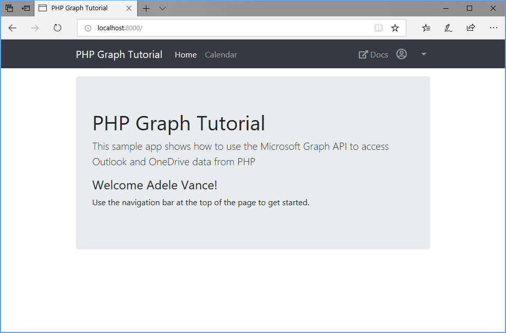

<!-- markdownlint-disable MD002 MD041 -->

<span data-ttu-id="946d8-101">この演習では、Azure AD での認証をサポートするために、前の手順で作成したアプリケーションを拡張します。</span><span class="sxs-lookup"><span data-stu-id="946d8-101">In this exercise you will extend the application from the previous exercise to support authentication with Azure AD.</span></span> <span data-ttu-id="946d8-102">これは、Microsoft Graph を呼び出すために必要な OAuth アクセストークンを取得するために必要です。</span><span class="sxs-lookup"><span data-stu-id="946d8-102">This is required to obtain the necessary OAuth access token to call the Microsoft Graph.</span></span> <span data-ttu-id="946d8-103">この手順では、 [oauth2](https://github.com/thephpleague/oauth2-client)ライブラリをアプリケーションに統合します。</span><span class="sxs-lookup"><span data-stu-id="946d8-103">In this step you will integrate the [oauth2-client](https://github.com/thephpleague/oauth2-client) library into the application.</span></span>

<span data-ttu-id="946d8-104">PHP アプリケーション`.env`のルートにあるファイルを開き、ファイルの末尾に次のコードを追加します。</span><span class="sxs-lookup"><span data-stu-id="946d8-104">Open the `.env` file in the root of your PHP application, and add the following code to the end of the file.</span></span>

```text
OAUTH_APP_ID=YOUR_APP_ID_HERE
OAUTH_APP_PASSWORD=YOUR_APP_PASSWORD_HERE
OAUTH_REDIRECT_URI=http://localhost:8000/callback
OAUTH_SCOPES='openid profile offline_access user.read calendars.read'
OAUTH_AUTHORITY=https://login.microsoftonline.com/common
OAUTH_AUTHORIZE_ENDPOINT=/oauth2/v2.0/authorize
OAUTH_TOKEN_ENDPOINT=/oauth2/v2.0/token
```

<span data-ttu-id="946d8-105">を`YOUR APP ID HERE`アプリケーション登録ポータルからのアプリケーション ID に置き換え、生成し`YOUR APP SECRET HERE`たパスワードに置き換えます。</span><span class="sxs-lookup"><span data-stu-id="946d8-105">Replace `YOUR APP ID HERE` with the application ID from the Application Registration Portal, and replace `YOUR APP SECRET HERE` with the password you generated.</span></span>

> [!IMPORTANT]
> <span data-ttu-id="946d8-106">git などのソース管理を使用している場合は、アプリ ID とパスワードを誤っ`.env`てリークしないように、ソース管理からファイルを除外することをお勧めします。</span><span class="sxs-lookup"><span data-stu-id="946d8-106">If you're using source control such as git, now would be a good time to exclude the `.env` file from source control to avoid inadvertently leaking your app ID and password.</span></span>

## <a name="implement-sign-in"></a><span data-ttu-id="946d8-107">サインインの実装</span><span class="sxs-lookup"><span data-stu-id="946d8-107">Implement sign-in</span></span>

<span data-ttu-id="946d8-108">という名前`./app/Http/Controllers` `AuthController.php`のディレクトリに新しいファイルを作成し、次のコードを追加します。</span><span class="sxs-lookup"><span data-stu-id="946d8-108">Create a new file in the `./app/Http/Controllers` directory named `AuthController.php` and add the following code.</span></span>

```PHP
<?php

namespace App\Http\Controllers;

use App\Http\Controllers\Controller;
use Illuminate\Http\Request;

class AuthController extends Controller
{
  public function signin()
  {
    // Initialize the OAuth client
    $oauthClient = new \League\OAuth2\Client\Provider\GenericProvider([
      'clientId'                => env('OAUTH_APP_ID'),
      'clientSecret'            => env('OAUTH_APP_PASSWORD'),
      'redirectUri'             => env('OAUTH_REDIRECT_URI'),
      'urlAuthorize'            => env('OAUTH_AUTHORITY').env('OAUTH_AUTHORIZE_ENDPOINT'),
      'urlAccessToken'          => env('OAUTH_AUTHORITY').env('OAUTH_TOKEN_ENDPOINT'),
      'urlResourceOwnerDetails' => '',
      'scopes'                  => env('OAUTH_SCOPES')
    ]);

    $authUrl = $oauthClient->getAuthorizationUrl();

    // Save client state so we can validate in callback
    session(['oauthState' => $oauthClient->getState()]);

    // Redirect to AAD signin page
    return redirect()->away($authUrl);
  }

  public function callback(Request $request)
  {
    // Validate state
    $expectedState = session('oauthState');
    $request->session()->forget('oauthState');
    $providedState = $request->query('state');

    if (!isset($expectedState) || !isset($providedState) || $expectedState != $providedState) {
      return redirect('/')
        ->with('error', 'Invalid auth state')
        ->with('errorDetail', 'The provided auth state did not match the expected value');
    }

    // Authorization code should be in the "code" query param
    $authCode = $request->query('code');
    if (isset($authCode)) {
      // Initialize the OAuth client
      $oauthClient = new \League\OAuth2\Client\Provider\GenericProvider([
        'clientId'                => env('OAUTH_APP_ID'),
        'clientSecret'            => env('OAUTH_APP_PASSWORD'),
        'redirectUri'             => env('OAUTH_REDIRECT_URI'),
        'urlAuthorize'            => env('OAUTH_AUTHORITY').env('OAUTH_AUTHORIZE_ENDPOINT'),
        'urlAccessToken'          => env('OAUTH_AUTHORITY').env('OAUTH_TOKEN_ENDPOINT'),
        'urlResourceOwnerDetails' => '',
        'scopes'                  => env('OAUTH_SCOPES')
      ]);

      try {
        // Make the token request
        $accessToken = $oauthClient->getAccessToken('authorization_code', [
          'code' => $authCode
        ]);

        // TEMPORARY FOR TESTING!
        return redirect('/')
          ->with('error', 'Access token received')
          ->with('errorDetail', $accessToken->getToken());
      }
      catch (League\OAuth2\Client\Provider\Exception\IdentityProviderException $e) {
        return redirect('/')
          ->with('error', 'Error requesting access token')
          ->with('errorDetail', $e->getMessage());
      }
    }

    return redirect('/')
      ->with('error', $request->query('error'))
      ->with('errorDetail', $request->query('error_description'));
  }
}
```

<span data-ttu-id="946d8-109">これにより、 `signin`と`callback`いう2つのアクションを持つコントローラーが定義されます。</span><span class="sxs-lookup"><span data-stu-id="946d8-109">This defines a controller with two actions: `signin` and `callback`.</span></span>

<span data-ttu-id="946d8-110">この`signin`アクションは、azure ad サインイン URL を生成し`state` 、OAuth クライアントによって生成された値を保存してから、ブラウザーを azure ad サインインページにリダイレクトします。</span><span class="sxs-lookup"><span data-stu-id="946d8-110">The `signin` action generates the Azure AD signin URL, saves the `state` value generated by the OAuth client, then redirects the browser to the Azure AD signin page.</span></span>

<span data-ttu-id="946d8-111">この`callback`操作では、サインインの完了後に Azure がリダイレクトされます。</span><span class="sxs-lookup"><span data-stu-id="946d8-111">The `callback` action is where Azure redirects after the signin is complete.</span></span> <span data-ttu-id="946d8-112">この操作により、 `state`値が保存された値と一致するようになり、ユーザーは、アクセストークンを要求するために Azure によって送信された認証コードを確認します。</span><span class="sxs-lookup"><span data-stu-id="946d8-112">That action makes sure the `state` value matches the saved value, then users the authorization code sent by Azure to request an access token.</span></span> <span data-ttu-id="946d8-113">その後、一時的なエラー値でアクセストークンを使用して、ホームページにリダイレクトします。</span><span class="sxs-lookup"><span data-stu-id="946d8-113">It then redirects back to the home page with the access token in the temporary error value.</span></span> <span data-ttu-id="946d8-114">これを使用して、サインインが機能していることを確認してから、に進みます。</span><span class="sxs-lookup"><span data-stu-id="946d8-114">We'll use this to verify that our sign-in is working before moving on.</span></span> <span data-ttu-id="946d8-115">テストを開始する前に、に`./routes/web.php`ルートを追加する必要があります。</span><span class="sxs-lookup"><span data-stu-id="946d8-115">Before we test, we need to add the routes to `./routes/web.php`.</span></span>

```PHP
Route::get('/signin', 'AuthController@signin');
Route::get('/callback', 'AuthController@callback');
```

<span data-ttu-id="946d8-116">サーバーを起動し、を`https://localhost:8000`参照します。</span><span class="sxs-lookup"><span data-stu-id="946d8-116">Start the server and browse to `https://localhost:8000`.</span></span> <span data-ttu-id="946d8-117">[サインイン] ボタンをクリックすると、に`https://login.microsoftonline.com`リダイレクトされます。</span><span class="sxs-lookup"><span data-stu-id="946d8-117">Click the sign-in button and you should be redirected to `https://login.microsoftonline.com`.</span></span> <span data-ttu-id="946d8-118">Microsoft アカウントを使用してログインし、要求されたアクセス許可に同意します。</span><span class="sxs-lookup"><span data-stu-id="946d8-118">Login with your Microsoft account and consent to the requested permissions.</span></span> <span data-ttu-id="946d8-119">ブラウザーがアプリにリダイレクトし、トークンが表示されます。</span><span class="sxs-lookup"><span data-stu-id="946d8-119">The browser redirects to the app, showing the token.</span></span>

### <a name="get-user-details"></a><span data-ttu-id="946d8-120">ユーザーの詳細を取得する</span><span class="sxs-lookup"><span data-stu-id="946d8-120">Get user details</span></span>

<span data-ttu-id="946d8-121">Microsoft Graph `callback`からユーザー `/app/Http/Controllers/AuthController.php`のプロファイルを取得するには、のメソッドを更新します。</span><span class="sxs-lookup"><span data-stu-id="946d8-121">Update the `callback` method in `/app/Http/Controllers/AuthController.php` to get the user's profile from Microsoft Graph.</span></span>

<span data-ttu-id="946d8-122">最初に、次`use`のステートメントをファイルの先頭 (行の`namespace App\Http\Controllers;`下) に追加します。</span><span class="sxs-lookup"><span data-stu-id="946d8-122">First, add the following `use` statements to the top of the file, beneath the `namespace App\Http\Controllers;` line.</span></span>

```php
use Microsoft\Graph\Graph;
use Microsoft\Graph\Model;
```

<span data-ttu-id="946d8-123">`callback`メソッド内の`try`ブロックを次のコードに置き換えます。</span><span class="sxs-lookup"><span data-stu-id="946d8-123">Replace the `try` block in the `callback` method with the following code.</span></span>

```php
try {
  // Make the token request
  $accessToken = $oauthClient->getAccessToken('authorization_code', [
    'code' => $authCode
  ]);

  $graph = new Graph();
  $graph->setAccessToken($accessToken->getToken());

  $user = $graph->createRequest('GET', '/me')
    ->setReturnType(Model\User::class)
    ->execute();

  // TEMPORARY FOR TESTING!
  return redirect('/')
    ->with('error', 'Access token received')
    ->with('errorDetail', 'User:'.$user->getDisplayName().', Token:'.$accessToken->getToken());
}
```

<span data-ttu-id="946d8-124">新しいコードは、 `Graph`オブジェクトを作成し、アクセストークンを割り当ててから、それを使用してユーザーのプロファイルを要求します。</span><span class="sxs-lookup"><span data-stu-id="946d8-124">The new code creates a `Graph` object, assigns the access token, then uses it to request the user's profile.</span></span> <span data-ttu-id="946d8-125">テストのために、ユーザーの表示名を一時出力に追加します。</span><span class="sxs-lookup"><span data-stu-id="946d8-125">It adds the user's display name to the temporary output for testing.</span></span>

## <a name="storing-the-tokens"></a><span data-ttu-id="946d8-126">トークンの格納</span><span class="sxs-lookup"><span data-stu-id="946d8-126">Storing the tokens</span></span>

<span data-ttu-id="946d8-127">トークンを入手できるようになったので、これをアプリに保存する方法を実装します。</span><span class="sxs-lookup"><span data-stu-id="946d8-127">Now that you can get tokens, it's time to implement a way to store them in the app.</span></span> <span data-ttu-id="946d8-128">これはサンプルアプリなので、わかりやすくするために、セッションに格納します。</span><span class="sxs-lookup"><span data-stu-id="946d8-128">Since this is a sample app, for simplicity's sake, you'll store them in the session.</span></span> <span data-ttu-id="946d8-129">実際のアプリケーションでは、データベースのような、より信頼性の高いセキュリティで保護されたストレージソリューションを使用します。</span><span class="sxs-lookup"><span data-stu-id="946d8-129">A real-world app would use a more reliable secure storage solution, like a database.</span></span>

<span data-ttu-id="946d8-130">という名前`./app` `TokenStore`のディレクトリに新しいディレクトリを作成し、そのディレクトリに新しいファイルを`TokenCache.php`作成して、次のコードを追加します。</span><span class="sxs-lookup"><span data-stu-id="946d8-130">Create a new directory in the `./app` directory named `TokenStore`, then create a new file in that directory named `TokenCache.php`, and add the following code.</span></span>

```php
<?php

namespace App\TokenStore;

class TokenCache {
  public function storeTokens($accessToken, $user) {
    session([
      'accessToken' => $accessToken->getToken(),
      'refreshToken' => $accessToken->getRefreshToken(),
      'tokenExpires' => $accessToken->getExpires(),
      'userName' => $user->getDisplayName(),
      'userEmail' => null !== $user->getMail() ? $user->getMail() : $user->getUserPrincipalName()
    ]);
  }

  public function clearTokens() {
    session()->forget('accessToken');
    session()->forget('refreshToken');
    session()->forget('tokenExpires');
    session()->forget('userName');
    session()->forget('userEmail');
  }

  public function getAccessToken() {
    // Check if tokens exist
    if (empty(session('accessToken')) ||
        empty(session('refreshToken')) ||
        empty(session('tokenExpires'))) {
      return '';
    }

    return session('accessToken');
  }
}
```

<span data-ttu-id="946d8-131">次に、 `AuthController`クラス`callback`の関数を更新してトークンをセッションに格納し、メインページにリダイレクトします。</span><span class="sxs-lookup"><span data-stu-id="946d8-131">Then, update the `callback` function in the `AuthController` class to store the tokens in the session and redirect back to the main page.</span></span>

<span data-ttu-id="946d8-132">最初に、次`use`のステートメントをの`./app/Http/Controllers/AuthController.php`先頭に、 `namespace App\Http\Controllers;`行の下に追加します。</span><span class="sxs-lookup"><span data-stu-id="946d8-132">First, add the following `use` statement to the top of `./app/Http/Controllers/AuthController.php`, beneath the `namespace App\Http\Controllers;` line.</span></span>

```php
use App\TokenStore\TokenCache;
```

<span data-ttu-id="946d8-133">次に、 `try`既存`callback`の関数内のブロックを次のように置き換えます。</span><span class="sxs-lookup"><span data-stu-id="946d8-133">Then replace the `try` block in the existing `callback` function with the following.</span></span>

```php
try {
  // Make the token request
  $accessToken = $oauthClient->getAccessToken('authorization_code', [
    'code' => $authCode
  ]);

  $graph = new Graph();
  $graph->setAccessToken($accessToken->getToken());

  $user = $graph->createRequest('GET', '/me')
    ->setReturnType(Model\User::class)
    ->execute();

  $tokenCache = new TokenCache();
  $tokenCache->storeTokens($accessToken, $user);

  return redirect('/');
}
```

## <a name="implement-sign-out"></a><span data-ttu-id="946d8-134">サインアウトを実装する</span><span class="sxs-lookup"><span data-stu-id="946d8-134">Implement sign-out</span></span>

<span data-ttu-id="946d8-135">この新しい機能をテストする前に、サインアウトする方法を追加します。`AuthController`クラスに次のアクションを追加します。</span><span class="sxs-lookup"><span data-stu-id="946d8-135">Before you test this new feature, add a way to sign out. Add the following action to the `AuthController` class.</span></span>

```PHP
public function signout()
{
  $tokenCache = new TokenCache();
  $tokenCache->clearTokens();
  return redirect('/');
}
```

<span data-ttu-id="946d8-136">このアクションをに`./routes/web.php`追加します。</span><span class="sxs-lookup"><span data-stu-id="946d8-136">Add this action to `./routes/web.php`.</span></span>

```PHP
Route::get('/signout', 'AuthController@signout');
```

<span data-ttu-id="946d8-137">サーバーを再起動し、サインインプロセスを実行します。</span><span class="sxs-lookup"><span data-stu-id="946d8-137">Restart the server and go through the sign-in process.</span></span> <span data-ttu-id="946d8-138">ホームページに戻る必要がありますが、UI は、サインインしていることを示すように変更する必要があります。</span><span class="sxs-lookup"><span data-stu-id="946d8-138">You should end up back on the home page, but the UI should change to indicate that you are signed-in.</span></span>



<span data-ttu-id="946d8-140">右上隅にあるユーザーアバターをクリックして、[**サインアウト**] リンクにアクセスします。</span><span class="sxs-lookup"><span data-stu-id="946d8-140">Click the user avatar in the top right corner to access the **Sign Out** link.</span></span> <span data-ttu-id="946d8-141">[**サインアウト**] をクリックすると、セッションがリセットされ、ホームページに戻ります。</span><span class="sxs-lookup"><span data-stu-id="946d8-141">Clicking **Sign Out** resets the session and returns you to the home page.</span></span>

![[サインアウト] リンクがあるドロップダウンメニューのスクリーンショット](./images/add-aad-auth-02.png)

## <a name="refreshing-tokens"></a><span data-ttu-id="946d8-143">トークンの更新</span><span class="sxs-lookup"><span data-stu-id="946d8-143">Refreshing tokens</span></span>

<span data-ttu-id="946d8-144">この時点で、アプリケーションには、API 呼び出しの`Authorization`ヘッダーで送信されるアクセストークンがあります。</span><span class="sxs-lookup"><span data-stu-id="946d8-144">At this point your application has an access token, which is sent in the `Authorization` header of API calls.</span></span> <span data-ttu-id="946d8-145">これは、アプリがユーザーに代わって Microsoft Graph にアクセスできるようにするトークンです。</span><span class="sxs-lookup"><span data-stu-id="946d8-145">This is the token that allows the app to access the Microsoft Graph on the user's behalf.</span></span>

<span data-ttu-id="946d8-146">ただし、このトークンは存続期間が短くなります。</span><span class="sxs-lookup"><span data-stu-id="946d8-146">However, this token is short-lived.</span></span> <span data-ttu-id="946d8-147">トークンが発行された後、有効期限が切れる時間になります。</span><span class="sxs-lookup"><span data-stu-id="946d8-147">The token expires an hour after it is issued.</span></span> <span data-ttu-id="946d8-148">ここでは、更新トークンが有効になります。</span><span class="sxs-lookup"><span data-stu-id="946d8-148">This is where the refresh token becomes useful.</span></span> <span data-ttu-id="946d8-149">更新トークンを使用すると、ユーザーが再度サインインする必要なく、新しいアクセストークンをアプリで要求できます。</span><span class="sxs-lookup"><span data-stu-id="946d8-149">The refresh token allows the app to request a new access token without requiring the user to sign in again.</span></span> <span data-ttu-id="946d8-150">トークンの更新を実装するために、トークン管理コードを更新します。</span><span class="sxs-lookup"><span data-stu-id="946d8-150">Update the token management code to implement token refresh.</span></span>

<span data-ttu-id="946d8-151">を`./app/TokenStore/TokenCache.php`開き、次の関数を`TokenCache`クラスに追加します。</span><span class="sxs-lookup"><span data-stu-id="946d8-151">Open `./app/TokenStore/TokenCache.php` and add the following function to the `TokenCache` class.</span></span>

```php
public function updateTokens($accessToken) {
  session([
    'accessToken' => $accessToken->getToken(),
    'refreshToken' => $accessToken->getRefreshToken(),
    'tokenExpires' => $accessToken->getExpires()
  ]);
}
```

<span data-ttu-id="946d8-152">次に、既存`getAccessToken`の関数を次のように置き換えます。</span><span class="sxs-lookup"><span data-stu-id="946d8-152">Then replace the existing `getAccessToken` function with the following.</span></span>

```php
public function getAccessToken() {
  // Check if tokens exist
  if (empty(session('accessToken')) ||
      empty(session('refreshToken')) ||
      empty(session('tokenExpires'))) {
    return '';
  }

  // Check if token is expired
  //Get current time + 5 minutes (to allow for time differences)
  $now = time() + 300;
  if (session('tokenExpires') <= $now) {
    // Token is expired (or very close to it)
    // so let's refresh

    // Initialize the OAuth client
    $oauthClient = new \League\OAuth2\Client\Provider\GenericProvider([
      'clientId'                => env('OAUTH_APP_ID'),
      'clientSecret'            => env('OAUTH_APP_PASSWORD'),
      'redirectUri'             => env('OAUTH_REDIRECT_URI'),
      'urlAuthorize'            => env('OAUTH_AUTHORITY').env('OAUTH_AUTHORIZE_ENDPOINT'),
      'urlAccessToken'          => env('OAUTH_AUTHORITY').env('OAUTH_TOKEN_ENDPOINT'),
      'urlResourceOwnerDetails' => '',
      'scopes'                  => env('OAUTH_SCOPES')
    ]);

    try {
      $newToken = $oauthClient->getAccessToken('refresh_token', [
        'refresh_token' => session('refreshToken')
      ]);

      // Store the new values
      $this->updateTokens($newToken);

      return $newToken->getToken();
    }
    catch (League\OAuth2\Client\Provider\Exception\IdentityProviderException $e) {
      return '';
    }
  }

  // Token is still valid, just return it
  return session('accessToken');
}
```

<span data-ttu-id="946d8-153">このメソッドは、最初にアクセストークンの有効期限が切れているか、期限切れになるかを確認します。</span><span class="sxs-lookup"><span data-stu-id="946d8-153">This method first checks if the access token is expired or close to expiring.</span></span> <span data-ttu-id="946d8-154">その場合は、更新トークンを使用して新しいトークンを取得し、次にキャッシュを更新して、新しいアクセストークンを返します。</span><span class="sxs-lookup"><span data-stu-id="946d8-154">If it is, then it uses the refresh token to get new tokens, then updates the cache and returns the new access token.</span></span>